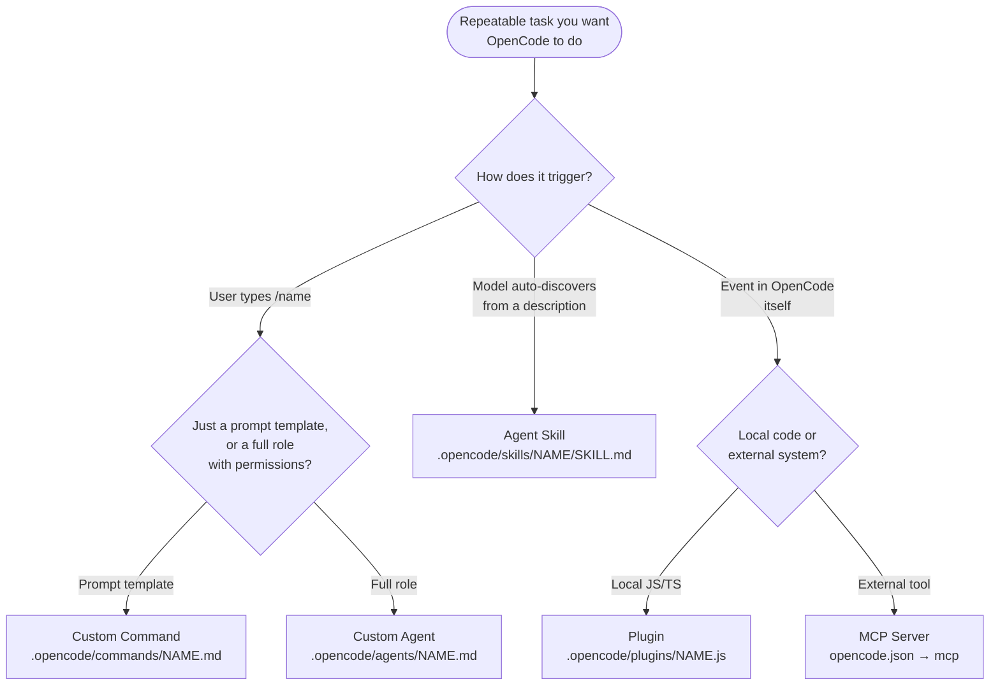

# OpenCode: Everything You Need to Know

A practical guide to [OpenCode](https://opencode.ai) — from your first prompt to custom agents, skills, plugins, and MCP integrations. Built around clear mental models and real examples, not marketing.

[](LICENSE)
[](https://github.com/anomalyco/opencode/releases)
[](#updates--deprecations)
[](CONTRIBUTING.md)

```bash
curl -fsSL https://opencode.ai/install | bash
```

**Who this is for:** Developers using (or about to use) [OpenCode](https://opencode.ai). Beginners get a guided path; power users get depth on Custom Commands, Skills, Plugins, MCP, and Agents.

> ⚖️ **Not affiliated with the OpenCode team.** This is a community-maintained guide. For the canonical, authoritative source, always check [opencode.ai/docs](https://opencode.ai/docs/) and [github.com/anomalyco/opencode](https://github.com/anomalyco/opencode).

---

## 🧭 Choose your path

| You are… | Start here | Time |
|---|---|---|
| 🚀 **New to OpenCode** | [Setup](#opencode-setup) → [Modes & Prompting](#prompt-engineering-deep-dive) → [Your First Command](#custom-commands) | ~15 min |
| ⚡ **Already using it, want depth** | [Custom Commands](#custom-commands) · [Skills](#agent-skills) · [Plugins](#plugins) · [MCP](#model-context-protocol-mcp) | ~20 min each |
| 🧠 **Configuring teams or running headless** | [Custom Agents](#custom-agents) · [Headless & CI](#headless--ci-usage) · [OpenCode Zen](#opencode-zen) | varies |

---

## 🧠 When to use what

OpenCode has five extension points. Pick by trigger and surface:



Same information as a table:

| Tool | Use when… | Skip if… | Lives in |
|---|---|---|---|
| **[Custom Commands](#custom-commands)** *(slash commands)* | You repeat the same prompt or workflow ≥3 times | One-off task | `.opencode/commands/*.md` |
| **[Agent Skills](#agent-skills)** | You want OpenCode to **auto-discover** and load a workflow when the description matches | You only want manual invocation | `.opencode/skills/<name>/SKILL.md` |
| **[Plugins](#plugins)** | You want JS/TS code to run **automatically** on events (tool calls, file edits, session lifecycle) | You only want chat-driven extensions | `.opencode/plugins/*.{js,ts}` |
| **[Subagents](#subagents)** | A subtask is big or context-heavy enough to need its own session | The task fits in your main session | `.opencode/agents/<name>.md` *(mode: `subagent`)* |
| **[MCP servers](#model-context-protocol-mcp)** | You need OpenCode to use **external** tools (browsers, DBs, APIs, search) | All your data is in local files | `opencode.json` → `mcp` |

> 💡 These five compose. Most polished workflows combine 2–3.

---

## 📚 What's inside

The README is the orientation. Deep dives live under [`docs/`](docs/); references under [`docs/reference/`](docs/reference/). Drop-in role prompts live under [`specialized-agents/`](specialized-agents/), MCP walkthroughs under [`mcp-servers/`](mcp-servers/), and a worked example of a configured project under [`.opencode/`](.opencode/).

| Topic | In the README | Deep dive |
|---|---|---|
| **Fundamentals** | [What is OpenCode?](#what-is-opencode) · [Setup](#opencode-setup) · [Prompt Engineering](#prompt-engineering-deep-dive) | [`docs/quickstart.md`](docs/quickstart.md) |
| **Provider & models** | [OpenCode Zen](#opencode-zen) · [Configuring providers](#configuring-providers) | [`docs/zen.md`](docs/zen.md) |
| **Workflow extensions** | [Slash Commands](#slash-commands) · [Custom Commands](#custom-commands) · [Agent Skills](#agent-skills) · [Plugins](#plugins) | [`docs/commands.md`](docs/commands.md) · [`docs/skills.md`](docs/skills.md) · [`docs/plugins.md`](docs/plugins.md) |
| **Multi-agent & integration** | [Subagents](#subagents) · [Custom Agents](#custom-agents) · [MCP](#model-context-protocol-mcp) | [`docs/agents.md`](docs/agents.md) · [`docs/mcp.md`](docs/mcp.md) |
| **Productivity & runtime** | [TUI Mastery](#tui-mastery) · [Themes](#themes) · [Headless & CI](#headless--ci-usage) · [Sharing](#sharing) | [`docs/tui.md`](docs/tui.md) · [`docs/workflows.md`](docs/workflows.md) |
| **Migration** | — | [`docs/migration.md`](docs/migration.md) *(Claude Code · Cursor · Copilot · Aider)* |
| **Reference** | [FAQ](#faq) · [Updates & Deprecations](#updates--deprecations) · [Further Reading](#references) | [CLI](docs/reference/cli.md) · [Slash commands](docs/reference/slash-commands.md) · [Permissions](docs/reference/permissions.md) · [Full FAQ](docs/reference/faq.md) · [Changelog](docs/reference/changelog.md) · [Further reading](docs/reference/further-reading.md) |

---

### What is OpenCode?

OpenCode is an open-source AI coding agent — a terminal app (TUI), desktop app, and IDE extension that reads your repo, runs commands, edits files, and talks to any LLM you point it at. It's maintained by [Anomaly](https://github.com/anomalyco) and shipped under the MIT license.

**Three things it does that a chat UI can't:**

- **Reads your actual repo** — not pasted snippets. It greps your files, follows imports, and grounds answers in real context using built-in `read`/`grep`/`glob` tools.
- **Edits in place and runs your stack** — diff-aware `edit`/`write`/`apply_patch`, then `bash` to run your tests, linter, or build on the spot.
- **Composes with the rest of your toolchain** — multi-provider models, custom slash commands, agent skills, JS/TS plugins, MCP servers, LSP, formatters, and an HTTP server for CI use.

**Three interfaces:**

| Surface | Command | When |
|---|---|---|
| **TUI** (default) | `opencode` | Interactive day-to-day work in your terminal |
| **CLI / headless** | `opencode run "<prompt>"` | Scripts, CI jobs, one-shot prompts |
| **Server** | `opencode serve` or `opencode web` | Headless API, web UI, or remote attach |

```bash
opencode                        # start TUI in the current repo
opencode run "fix the failing test in src/api.test.ts"
opencode serve --port 4096      # headless server
```

> OpenCode sits in the same space as Claude Code, Cursor, and Aider — same problem, different trade-offs. OpenCode is provider-agnostic and open source; Claude Code is tightly integrated with Anthropic; Cursor embeds in a VS Code fork; Aider is leaner and Python-based. None is universally better — pick the one whose model, surface, and ecosystem fit your workflow.

> ⚠️ **AI-coding caveat:** OpenCode (like every coding agent) can produce wrong code, miss edge cases, hallucinate APIs, and over-apply patterns. **You're still the reviewer.** Read diffs before accepting, run tests, and don't auto-approve destructive operations on code you care about.

---

### OpenCode Setup

> ⏱️ **5-minute setup.** From zero to your first AI-assisted commit.

#### 1. Install

```bash
curl -fsSL https://opencode.ai/install | bash
```

Other supported installers (pick whichever you already use):

```bash
npm i -g opencode-ai@latest        # npm / pnpm / yarn / bun all work
brew install anomalyco/tap/opencode # macOS / Linux
brew install opencode               # if you've added the tap
scoop install opencode              # Windows
choco install opencode              # Windows
sudo pacman -S opencode             # Arch
paru -S opencode-bin                # Arch (AUR)
mise use -g opencode                # mise users
nix run nixpkgs#opencode            # Nix
```

A desktop app for macOS / Windows / Linux is in beta at [opencode.ai/download](https://opencode.ai/download).

> 📚 The full install matrix (including Windows/WSL, Docker, enterprise managed configs) lives at [opencode.ai/docs](https://opencode.ai/docs).

#### 2. Authenticate

Run `opencode` and use `/connect` from the TUI, or sign in from the CLI:

```bash
opencode auth login        # interactive provider picker
opencode auth list         # see who you're signed in to
```

You can point OpenCode at:

- **Direct providers** — Anthropic, OpenAI, Google, Groq, OpenRouter, AWS Bedrock, Azure, Ollama, LM Studio, and more (full list at [opencode.ai/docs/providers](https://opencode.ai/docs/providers)). Best if you already have credits with a provider or want to run locally.
- **[OpenCode Zen](#opencode-zen)** — pay-as-you-go gateway curated by the OpenCode team. Best if you want one key and a vetted lineup; pricier per token than going direct in some cases.
- **Local models** via Ollama or LM Studio. Best for offline work or strict data-residency requirements; quality varies widely by model and hardware.

There's no "right" default — pick what fits your existing accounts, budget, and privacy posture.

#### 3. First prompt

From any project directory:

```bash
cd ~/your-project
opencode
```

Try one of these once the TUI is up:

- `explain what this codebase does` — OpenCode reads your repo and summarizes.
- `add a README section about installation` — generates content based on what's already there.
- `find and fix the failing test in src/api.test.ts` — diagnoses and edits in place.

#### 4. Generate an `AGENTS.md`

```
/init
```

`/init` walks you through generating an `AGENTS.md` file — your project's "house rules" that OpenCode reads every session (build/test commands, conventions, architecture). Commit it to git. More in [Prompt Engineering Deep Dive](#prompt-engineering-deep-dive).

> 📝 **Coming from Claude Code?** OpenCode reads `CLAUDE.md` as a fallback if no `AGENTS.md` exists. Migrate by renaming the file or letting `/init` generate a fresh one. Disable the fallback with `OPENCODE_DISABLE_CLAUDE_CODE=1`.

#### 5. (Bonus) See a real OpenCode project setup

This repo's own [`.opencode/`](.opencode/) directory is a working example of a fully-configured project. Browse it as a reference:

| Path | What it does |
|---|---|
| [`.opencode/agents/`](.opencode/agents) | Custom agent definitions (markdown + YAML frontmatter) |
| [`.opencode/commands/`](.opencode/commands) | Custom slash commands — invoke with `/<name>` |
| [`.opencode/skills/`](.opencode/skills) | Auto-discovered agent skills with `SKILL.md` files |
| [`AGENTS.md`](AGENTS.md) | Project instructions OpenCode reads every session |

> 💡 **Next:** Once you're comfortable with the basics, jump to [Custom Commands](#custom-commands) to build reusable slash commands in 3 minutes.

---

### OpenCode Zen

> **Mental model:** Zen is OpenCode's curated, pay-as-you-go model gateway — a hand-picked roster of models the OpenCode team has tested and tuned for coding-agent workloads. One API key, dozens of models, billing in cents.

#### Setup

```bash
# 1. Visit https://opencode.ai/auth and create an account
# 2. Add billing details
# 3. Copy your API key
# 4. In OpenCode:
/connect            # pick "OpenCode Zen" and paste your key
/models             # browse what's available
```

Reference Zen models in `opencode.json` or `/model` using the `opencode/<model-id>` namespace.

#### Pricing snapshot (verified May 2026)

> Always check [opencode.ai/docs/zen](https://opencode.ai/docs/zen) — prices change.

> Model IDs use the format `opencode/<model-id>` in your config. Slugs preserve dots where the upstream model uses them (e.g. `gpt-5.5`, `gemini-3.1-pro`); Anthropic IDs use hyphens (`claude-opus-4-7`).

| Model ID | Input / Output (per MTok) | Reach for it when… |
|---|---|---|
| `opencode/claude-opus-4-7` | $5 / $25 | Complex reasoning, large refactors, multi-file analysis |
| `opencode/claude-sonnet-4-6` | $3 / $15 | Balanced everyday coding — the workhorse |
| `opencode/claude-haiku-4-5` | $1 / $5 | Fast, lightweight tasks — quick questions, doc edits |
| `opencode/gpt-5.5` *(≤272K)* | $5 / $30 | Long-context work, OpenAI ecosystem |
| `opencode/gpt-5.4-mini` | $0.75 / $4.50 | Cost-efficient frontier |
| `opencode/gpt-5.4-nano` | $0.20 / $1.25 | Cheap, fast, narrow tasks |
| `opencode/gemini-3.1-pro` | $2 / $12 | Multimodal, Google ecosystem |
| `opencode/qwen3.6-plus` | $0.50 / $3 | Budget-friendly heavy lifting |

**Free tier** *(rotating, for community feedback):* `deepseek-v4-flash-free`, `minimax-m2.5-free`, `nemotron-3-super-free`, `big-pickle` *(stealth)*. Great for learning without burning credits.

> Full model list (40+ entries with per-model pricing including cached read/write, GPT 5 Codex variants, GLM, Kimi, Claude Opus 4.5/4.6/4.1, etc.): [opencode.ai/docs/zen](https://opencode.ai/docs/zen).

#### Billing & limits

- **Auto-reload** — default $20 top-up when balance falls under $5. Configurable.
- **Workspaces** — monthly spending caps for teams; per-member limits available.
- **BYOK** — bring your own Anthropic / OpenAI keys and still use Zen for other providers.
- **Transaction fees** — credit card fees pass through at cost (4.4% + $0.30 per transaction).

> 💡 **Pattern: cheap explorer / strong executor.** Use a cheap model (`qwen3.6-plus`, `gpt-5.4-mini`) for `explore` and `scout` subagents that read a lot, and a stronger one (`claude-sonnet-4-6` or `claude-opus-4-7`) for the main `build` agent that does the editing.

---

### Configuring providers

If Zen isn't your thing, OpenCode talks to providers directly. Configuration lives in `opencode.json` (project-level) or `~/.config/opencode/opencode.json` (global). Both JSON and JSONC (comments) are supported.

```json
{
  "$schema": "https://opencode.ai/config.json",
  "model": "anthropic/claude-sonnet-4-5",
  "provider": {
    "anthropic": {
      "options": {
        "apiKey": "{env:ANTHROPIC_API_KEY}"
      }
    },
    "openai": {
      "options": {
        "apiKey": "{file:~/.secrets/openai-key}"
      }
    }
  }
}
```

**Variable substitution:**

- `{env:NAME}` — pulls from the environment
- `{file:./path}` — reads from a local file (absolute or relative)

**Per-agent model override:**

```json
{
  "agent": {
    "plan": { "model": "anthropic/claude-haiku-4-5" },
    "deep-thinker": {
      "model": "openai/gpt-5",
      "reasoningEffort": "high"
    }
  }
}
```

> 📚 Full config reference: [opencode.ai/docs/config](https://opencode.ai/docs/config) — includes `enabled_providers`, `disabled_providers`, formatter integration, LSP, watcher ignores, attachment limits, and more.

---

### Prompt Engineering Deep Dive

> **📖 Project Initialization**
> Run `/init` to auto-generate an `AGENTS.md`. Treat it like any frequently used prompt — iterate on it. Don't just dump 500 lines and forget; refine what produces the best follow-through from the model.

#### 1. Plan → Build cycle

OpenCode ships with two primary agents you can toggle between with **Tab**:

| Agent | What changes | Use it for |
|---|---|---|
| **`plan`** | `edit` and `bash` permissions default to `ask` — analysis without surprise writes | Reading code, designing approaches, reviewing diffs |
| **`build`** | Full tool access (default) | Implementation, refactors, running tests |

The natural workflow is **explore in plan, switch to build, commit**:

```text
[plan]  > how would you implement OAuth for this app?
       (OpenCode reads, plans, proposes — no writes happen)
[plan]  > <Tab>
[build] > do it
       (OpenCode implements, edits files, runs tests)
```

> 💡 **Pro Tip:** Research and plan first. For complex changes, prompts like `think hard`, `think more`, or `ultrathink` nudge depth on supported models — exactly the pattern the [Anthropic prompt engineering guide](https://docs.anthropic.com/en/docs/build-with-claude/prompt-engineering/overview) recommends.

#### 2. Test-Driven Workflow

Ideal for changes verifiable with unit or integration tests.

```text
[plan]  > write failing tests for a `slugify` util that handles unicode, spaces, and trailing punctuation
[build] > run the tests — confirm they fail
[build] > implement slugify so the tests pass
[build] > /share        (optional: capture the session)
```

Clear, executable targets (tests, mocks) drive iteration far more reliably than prose specs.

#### 3. File references and shell

Two characters that change how you talk to OpenCode:

| Syntax | What it does | Example |
|---|---|---|
| `@<path>` | Attach file content to the prompt (fuzzy search) | `look at @src/api/auth.ts` |
| `!<cmd>` | Run shell and inject the output | `!git diff` then ask Claude about it |

```text
> review @packages/api/src/handlers/auth.ts for missing input validation
> !pnpm test --reporter=verbose
> based on those failures, fix the auth handler
```

#### 4. Use `AGENTS.md` for project rules

```markdown
# AGENTS.md

## Commands
- build: `pnpm build`
- test:  `pnpm test`
- lint:  `pnpm lint && pnpm typecheck`

## Conventions
- TypeScript strict mode, no `any`
- Prefer named exports; default exports only for React components
- Tailwind first; CSS modules only for legacy code

## Don't
- Edit anything under `vendor/`
- Run migrations without confirmation
- Push to `main` directly
```

OpenCode reads `AGENTS.md` from the project root on every session start. Additional instruction files can be referenced via the `instructions` key in `opencode.json`:

```json
{
  "instructions": ["CONTRIBUTING.md", "docs/style-guide.md", ".cursor/rules/*.md"]
}
```

> 📚 Full guide: [opencode.ai/docs/rules](https://opencode.ai/docs/rules).

---

### Slash Commands

OpenCode ships a set of built-in slash commands plus everything you write yourself.

#### Built-in essentials

| Command | What it does |
|---|---|
| `/init` | Guided generation of `AGENTS.md` |
| `/help` | Show the help dialog |
| `/new` *(alias `/clear`)* | Start a new session |
| `/sessions` *(aliases `/resume`, `/continue`)* | List and switch between sessions |
| `/models` | Browse available models |
| `/connect` | Add a provider |
| `/themes` | Switch themes |
| `/compact` *(alias `/summarize`)* | Compact the current session to save tokens |
| `/share` · `/unshare` | Create or revoke a public link to the session |
| `/export` | Export conversation to Markdown |
| `/undo` · `/redo` | Step through edit history |
| `/editor` | Open `$EDITOR` to compose a long prompt |
| `/details` | Toggle visibility of tool execution details |
| `/thinking` | Toggle thinking/reasoning blocks |
| `/exit` *(aliases `/quit`, `/q`)* | Quit OpenCode |

> 📚 Full slash-command reference: [`docs/reference/slash-commands.md`](docs/reference/slash-commands.md). Built-in commands can be overridden by your own custom commands with the same name.

#### Custom slash commands — the 30-second version

Save a prompt as a markdown file in `.opencode/commands/`, invoke it forever:

```bash
mkdir -p .opencode/commands
cat > .opencode/commands/optimize.md << 'EOF'
---
description: Suggest performance improvements
---
Analyze the current code for performance bottlenecks. Propose specific,
measurable optimizations with before/after snippets.
EOF

opencode      # then type: /optimize
```

→ Deep dive in [Custom Commands](#custom-commands).

---

### Custom Commands

> **Mental model:** A custom command is a prompt template you've named. Whatever you save as `.opencode/commands/<name>.md` becomes `/<name>` in the TUI — with `$ARGUMENTS`, `@file`, and `!shell` placeholders interpolated at invocation time.

Minimal example:

```markdown
---
description: Run tests and triage failures
agent: build
---

!pnpm test --reporter=verbose

If any tests failed above, open the failing files and propose precise fixes.
Otherwise, summarize the coverage.
```

Save as `.opencode/commands/test.md` → invoke with `/test` in the TUI.

| Frontmatter key | Purpose |
|---|---|
| `description` (required) | One-liner shown in the slash-command palette |
| `agent` | Which agent runs it (`build`, `plan`, or a custom one) |
| `model` | Override the model just for this command |
| `subtask` | `true` runs as a subagent (isolated context) |

| Body placeholder | Substitutes |
|---|---|
| `$ARGUMENTS` / `$1` / `$2` | What the user typed after the command |
| `@<path>` | File content (fuzzy resolved) |
| `` `!<cmd>` `` | Shell stdout |

**This repo ships four examples in [`.opencode/commands/`](.opencode/commands/):** `/review`, `/pr`, `/test`, `/optimize`.

> 📚 Deep dive — frontmatter, body placeholders, override patterns, gotchas: [`docs/commands.md`](docs/commands.md) and [opencode.ai/docs/commands](https://opencode.ai/docs/commands).

---

### Agent Skills

> **Mental model:** A skill is a **discoverable** workflow. The agent sees the skill's `name` and `description` and decides on its own to load it when the task matches. You don't have to remember to invoke — the model does.

OpenCode uses Claude Code-compatible Agent Skill folders. Skill lookup paths (project → global → Claude-compatible → agent-compatible):

```
.opencode/skills/<name>/SKILL.md
~/.config/opencode/skills/<name>/SKILL.md
.claude/skills/<name>/SKILL.md
.agents/skills/<name>/SKILL.md
```

Each `SKILL.md` needs YAML frontmatter with a `name` (lowercase-kebab, ≤64 chars) and a `description` (1–1024 chars). The description is **the discovery signal** — write it like a trigger sentence the agent will recognize.

**Command vs. skill, in one line:** commands are user-invoked (`/<name>`), skills are model-invoked (description match). Write both for the same workflow if you want both surfaces.

**This repo ships one example:** [`.opencode/skills/git-release/SKILL.md`](.opencode/skills/git-release/SKILL.md).

> 📚 Deep dive — discovery patterns, permission gating, writing descriptions models actually pick up: [`docs/skills.md`](docs/skills.md) and [opencode.ai/docs/skills](https://opencode.ai/docs/skills).

---

### Plugins

> **Mental model:** Plugins are OpenCode's **lifecycle hooks** — small JavaScript/TypeScript modules that subscribe to events (tool calls, file edits, session state) and run code automatically. Think `husky`/`lefthook` for your AI session.

#### Where plugins live

| Scope | Path |
|---|---|
| Project | `.opencode/plugins/<name>.{js,ts}` |
| Global | `~/.config/opencode/plugins/<name>.{js,ts}` |
| NPM packages | `plugin` array in `opencode.json` |

NPM-installed plugins:

```json
{
  "plugin": [
    "opencode-helicone-session",
    "opencode-wakatime",
    "@my-org/custom-plugin"
  ]
}
```

These auto-install via Bun and cache under `~/.cache/opencode/node_modules/`.

Local plugins can use npm dependencies — drop a `package.json` next to them.

#### Plugin API

```javascript
export const NotifyOnSessionIdle = async ({ project, client, $, directory, worktree }) => {
  return {
    event: async ({ event }) => {
      if (event.type === "session.idle") {
        await $`osascript -e 'display notification "Session done!" with title "opencode"'`;
      }
    },
  };
};
```

Plugins receive a context object `{ project, directory, worktree, client, $ }` and return event handlers. `$` is the Bun shell — run any command from inside the plugin. Events span tools, files, sessions, messages, permissions, LSP, TUI, and more (~25 in total).

**This repo ships two working examples in [`.opencode/plugins/`](.opencode/plugins/):**

| File | What it does |
|---|---|
| [`protect-secrets.js`](.opencode/plugins/protect-secrets.js) | Blocks any tool call touching `.env*`, `secrets/`, SSH keys, etc. |
| [`audit-log.js`](.opencode/plugins/audit-log.js) | Appends every successful tool call to `.opencode/audit.jsonl` |

> ⚠️ **Security:** Plugins run arbitrary code with your user permissions. Read every third-party plugin before installing — exactly like reviewing a shell script before sourcing it.

> 📚 Deep dive — full event list, hook patterns (auto-format on save, idle notifications, sensitive-path blocking, audit logging), and gotchas: [`docs/plugins.md`](docs/plugins.md) and [opencode.ai/docs/plugins](https://opencode.ai/docs/plugins).

---

### Subagents

> **Mental model:** Subagents are **child sessions** spawned from your main session ([docs](https://opencode.ai/docs/agents#usage)). Each runs separately with its own focused scope and tool surface, so the main session doesn't have to carry their full conversation. Navigate between parent and children with the `session_child_*` keybinds (default: `<Leader>+↑/↓/←/→`).

#### Built-in subagents

| Subagent | Tools | Reach for it when… |
|---|---|---|
| **`general`** | Full toolset (minus `todowrite`) | Multi-step tasks you want isolated from the main session |
| **`explore`** | Read-only — `read`, `grep`, `glob`, `list` | "Where is X defined?" or quick code searches |
| **`scout`** | Read-only — `webfetch`, `websearch`, plus read tools | External docs and dependency research |

Invoke them by `@`-mentioning from your main session:

```text
@explore  Find every call site of `parseToken()` and summarize the patterns
@scout    What does the new Stripe SDK v15 say about idempotency keys?
@general  Refactor src/auth/ so OAuth and JWT flows share a single token service
```

#### Custom subagents

Drop a markdown file in `.opencode/agents/`:

```markdown
---
description: Performs security audits and flags vulnerabilities
mode: subagent
model: anthropic/claude-sonnet-4-5
temperature: 0.1
permission:
  edit: deny
  bash: deny
---

You are a security reviewer. Focus on OWASP Top 10 issues, secret leaks,
input validation, authentication, and authorization. Surface findings with:
- Severity (critical / high / medium / low)
- File and line
- Why it's a problem
- A concrete fix
Do not modify files — your job is to report.
```

The filename becomes the agent name. `security-auditor.md` → `@security-auditor`.

→ Full agent definition format and permission system in [Custom Agents](#custom-agents).

---

### Custom Agents

Beyond subagents, you can define **primary agents** (`mode: primary` or `mode: all`) — your own variants of `build` and `plan` with custom prompts, models, and permission profiles. Same markdown-with-YAML-frontmatter format as subagents.

Minimal example:

```markdown
---
description: Senior frontend engineer — Tailwind + React + TypeScript
mode: all
model: anthropic/claude-sonnet-4-5
permission:
  edit: allow
  bash:
    "*": "ask"
    "pnpm test*": "allow"
    "git status*": "allow"
---

You're a senior frontend engineer working on a React/Tailwind codebase…
```

Filename → agent name. `frontend-engineer.md` → invoked as `@frontend-engineer` (subagent) or in the Tab cycle (primary). The mode determines surfaces:

| `mode` | Where it appears |
|---|---|
| `primary` | Tab-cycle alongside `build`/`plan` |
| `subagent` | `@<name>` mentions only |
| `all` | Both |

Bash permissions accept a **glob-pattern map** (`{"*": "ask", "git status*": "allow", "rm -rf*": "deny"}`) — most-specific match wins.

> 📐 This repo ships **drop-in specialist prompts** in [`specialized-agents/`](specialized-agents/) — backend, frontend, code reviewer, security reviewer, tech lead, database, UX. Copy any of them into `.opencode/agents/<name>.md` to use.

> 📚 Deep dive — full frontmatter key list, permission model with all 16 keys, JSON-form alternative, picking a model per agent: [`docs/agents.md`](docs/agents.md) · [`docs/reference/permissions.md`](docs/reference/permissions.md) · [opencode.ai/docs/agents](https://opencode.ai/docs/agents).

---

### Model Context Protocol (MCP)

> MCP is the universal connector that lets OpenCode talk to **external tools** — browsers, databases, search engines, ticketing systems — through one open protocol. USB-C for AI integrations.

Declare servers in the `mcp` section of `opencode.json`. Local servers spawn a subprocess; remote servers hit an HTTPS endpoint and handle OAuth automatically via Dynamic Client Registration (RFC 7591).

```json
{
  "$schema": "https://opencode.ai/config.json",
  "mcp": {
    "playwright": {
      "type": "local",
      "command": ["npx", "-y", "@playwright/mcp@latest"]
    },
    "context7": {
      "type": "remote",
      "url": "https://mcp.context7.com/mcp",
      "headers": { "CONTEXT7_API_KEY": "{env:CONTEXT7_API_KEY}" }
    },
    "sentry": {
      "type": "remote",
      "url": "https://mcp.sentry.dev/mcp",
      "oauth": {}
    }
  }
}
```

Manage from the CLI: `opencode mcp add | list | auth <name> | logout <name> | debug <name>`. Reference a server's tools in a prompt with `use <server-name>`.

**Featured walkthroughs in [`mcp-servers/`](./mcp-servers/):**

| Server | What it adds |
|---|---|
| [Playwright](./mcp-servers/playwright.md) | Browser automation — DOM, network, screenshots, accessibility |
| [Context7](./mcp-servers/context7.md) | Live, version-pinned library docs piped into the prompt |
| [Sentry](./mcp-servers/sentry.md) | Errors, traces, releases |
| [Grep by Vercel](./mcp-servers/grep.md) | Code search across GitHub |

> ⚠️ **Token budget:** MCP tools land in the model's tool surface every turn — heavy servers can easily eat 10K+ tokens of context. Disable noisy tools with the `tools` map (e.g. `"github_*": false`).

> 📚 Deep dive — local/remote config, OAuth flow, registry discovery, troubleshooting: [`docs/mcp.md`](docs/mcp.md) · [opencode.ai/docs/mcp-servers](https://opencode.ai/docs/mcp-servers) · [registry.modelcontextprotocol.io](https://registry.modelcontextprotocol.io/).

---

### TUI Mastery

The TUI is where you'll spend most of your time. A few keys and patterns pay back the time it takes to learn them.

#### Leader key

OpenCode's TUI uses a **leader key** (default `ctrl+x`) followed by a single letter. It keeps single-keystroke editing keys free for the input box.

| Binding | Action |
|---|---|
| `ctrl+x n` | New session |
| `ctrl+x l` | List sessions |
| `ctrl+x c` | Compact session |
| `ctrl+x e` | Open external editor |
| `ctrl+x m` | Browse models |
| `ctrl+x t` | Switch theme |
| `ctrl+x u` / `ctrl+x r` | Undo / Redo |
| `ctrl+x b` | Toggle sidebar |
| `ctrl+x y` | Copy messages |
| `ctrl+x q` | Quit |
| `ctrl+p` | Command palette |
| `Tab` | Cycle primary agents (build ↔ plan ↔ custom) |
| `Esc` | Cancel / dismiss |

Readline shortcuts also work inside the prompt box:

| Shortcut | Action |
|---|---|
| `ctrl+a` / `ctrl+e` | Beginning / end of line |
| `ctrl+k` | Delete to end of line |
| `ctrl+u` | Delete to beginning of line |

#### Customizing keybinds

Put a `tui.json` next to your `opencode.json`:

```json
{
  "$schema": "https://opencode.ai/tui.json",
  "leader_timeout": 2000,
  "keybinds": {
    "command_list": "ctrl+p",
    "messages_copy": ["<leader>y", "ctrl+shift+c"],
    "input_paste": { "key": "ctrl+v", "preventDefault": false }
  }
}
```

Set any binding to `"none"` or `false` to disable it. Strings can be arrays for multiple bindings.

> 📚 Full keybind reference: [opencode.ai/docs/keybinds](https://opencode.ai/docs/keybinds).

---

### Themes

Built-in themes ship with OpenCode and can be set in `tui.json` or via `/themes`:

`system` · `tokyonight` · `everforest` · `ayu` · `catppuccin` · `catppuccin-macchiato` · `gruvbox` · `kanagawa` · `nord` · `matrix` · `one-dark`

```json
{
  "$schema": "https://opencode.ai/tui.json",
  "theme": "tokyonight"
}
```

**Custom themes** live in `.opencode/themes/<name>.json` (project) or `~/.config/opencode/themes/<name>.json` (global). Themes support hex (`"#ffffff"`), ANSI (0–255), references, dark/light variants, and `"none"` for terminal defaults. Truecolor terminals required.

> 📚 Full Themes guide: [opencode.ai/docs/themes](https://opencode.ai/docs/themes).

---

### Headless & CI Usage

OpenCode is built to run unattended. Three ways:

#### 1. One-shot prompts (`opencode run`)

```bash
opencode run "summarize the changes in the last 5 commits"
opencode run --format json "list every TODO comment with file and line" > todos.json
opencode run --agent plan --model anthropic/claude-haiku-4-5 \
  "audit src/ for missing input validation"
```

Useful flags:

| Flag | Purpose |
|---|---|
| `--continue` / `--session <id>` | Resume previous work |
| `--share` | Publish the resulting session |
| `--format json` | Machine-readable output |
| `--file <path>` | Attach a file to the prompt |
| `--dangerously-skip-permissions` | Auto-approve everything that isn't `deny` — **CI only** |

#### 2. Headless server (`opencode serve` / `opencode web`)

```bash
opencode serve --port 4096 --hostname 0.0.0.0
opencode web   --port 4096   # same, with a browser UI
```

Talk to it via the OpenCode SDK or attach another terminal:

```bash
opencode attach http://localhost:4096
```

#### 3. GitHub agent

```bash
opencode github install     # add a workflow file to your repo
opencode github run         # run locally with a mock event payload
opencode pr 123             # check out PR #123 and start a session
```

The installed GitHub Action lets you `@`-mention the OpenCode bot on issues and PRs.

#### Sessions, stats, sharing

```bash
opencode session list                  # browse past sessions
opencode session delete <id>           # delete one
opencode stats --days 30 --models      # token & cost report by model
opencode export <id> --sanitize        # JSON dump (with redaction)
opencode import session.json           # restore from JSON or share URL
```

> 📚 Full CLI reference: [`docs/reference/cli.md`](docs/reference/cli.md).

---

### Sharing

`/share` generates a public link to the current session (`opncd.ai/s/<id>`). Three modes via `opencode.json`:

```json
{ "share": "manual" }     // default — only when you ask
{ "share": "auto" }       // every new session is shared
{ "share": "disabled" }   // forbid sharing entirely
```

`/unshare` revokes the link. Enterprise builds can enforce `"disabled"` from a managed config so it's not bypassable.

> ⚠️ **Privacy:** Shared conversations live on OpenCode's servers until you unshare them. Don't share sessions with secrets, proprietary code, or confidential data.

> 📚 Full Sharing guide: [opencode.ai/docs/share](https://opencode.ai/docs/share).

---

### Limitations & when OpenCode isn't the right tool

Useful tools have honest weaknesses. OpenCode's:

| Limitation | Detail |
|---|---|
| **No inline editor completion** | OpenCode is a conversational agent, not a Copilot-style autocomplete. If your main pain is "ghost text while I type," reach for [Copilot](https://github.com/features/copilot), [Cursor Tab](https://cursor.sh/), [Codeium](https://codeium.com/), or [Supermaven](https://supermaven.com/) instead — or alongside. |
| **Quality depends on the underlying model** | OpenCode doesn't replace the LLM's reasoning. If your task fails on Claude Sonnet, switching to OpenCode won't magically fix it. |
| **Provider-agnostic ≠ provider-equivalent** | Some models work better with OpenCode's tool-use loop than others. Don't assume a slug swap is free. |
| **TUI on slow SSH / minimal terminals** | The TUI uses truecolor and complex layouts. Over a slow connection or a terminal that doesn't support 24-bit color, the experience degrades. `opencode serve` + `attach` helps; the desktop app or `opencode run` may be better for those cases. |
| **Plugins run arbitrary code** | Any plugin you install — local or npm — has full user permissions. Audit before installing. |
| **Free Zen models are explicitly time-limited** | The [Zen docs](https://opencode.ai/docs/zen) describe them as "available on OpenCode for a limited time" while the team collects feedback. Don't build production workflows around them. |
| **Documentation lags shipping** | OpenCode moves fast. This guide and even the official docs occasionally trail the actual binary. Run `opencode --version` and check release notes when something doesn't behave as documented. |
| **Not a substitute for code review** | Diff-aware edits and a passing test suite don't guarantee correct, secure, or maintainable code. Treat AI output as a junior teammate's PR: useful, not authoritative. |

**When OpenCode might be the wrong choice for you:**

- You want a polished, opinionated single-vendor product where everything just works → **Claude Code** or **Cursor** will feel more cohesive.
- You're deeply embedded in a VS Code workflow and want AI features inside the IDE → **Cursor** or **GitHub Copilot** integrates more tightly.
- You want a small, focused, well-understood Python tool you can read end-to-end → **[Aider](https://aider.chat/)** is leaner.
- You don't want to manage provider keys or configs at all → a hosted product with a managed billing flow may suit you better.

> The trade-off OpenCode makes: flexibility and openness over polish and single-vendor integration. Worth it for many use cases; not all.

---

### FAQ

*[→ Full FAQ in `docs/reference/faq.md`](docs/reference/faq.md)*

**Is OpenCode free?**
The software is open source (MIT). You pay for whichever LLM provider you use. [OpenCode Zen](#opencode-zen) is pay-as-you-go starting at fractions of a cent per request; bring your own Anthropic/OpenAI/Google key if you prefer.

**Does OpenCode work without an internet connection?**
Yes, if you point it at a local model (Ollama, LM Studio, llama.cpp). Network is needed for hosted providers, MCP remote servers, sharing, and updates.

**Can I migrate from Claude Code?**
Most concepts map cleanly but a few fields and file paths differ. OpenCode reads `CLAUDE.md` as a fallback for `AGENTS.md` and `.claude/skills/<name>/SKILL.md` for skills (so half your config keeps working untouched). Slash commands need to move from `.claude/commands/` to `.opencode/commands/`; Python hooks need to be rewritten as JS/TS plugins; subagent frontmatter uses different field names (`name` is gone, `mode` is new, `tools` becomes `permission`). See [the full migration guide](docs/migration.md). Set `OPENCODE_DISABLE_CLAUDE_CODE=1` once you've migrated.

**Custom commands vs. skills — which should I write?**
Both. Custom commands are **explicit** (you type `/<name>`); skills are **discoverable** (the model picks them up when the task matches). Use commands for workflows the user owns, skills for expertise the agent should reach for. See the comparison in [`docs/commands.md`](docs/commands.md#when-to-use-a-command-vs-a-skill-vs-an-agent).

**How do I keep OpenCode from running risky shell commands?**
Set `bash` permission to `"ask"` at the project level (default for the `plan` agent already), or use the glob form to whitelist only safe patterns. Full mechanism in [`docs/reference/permissions.md`](docs/reference/permissions.md).

**Where do I see my token usage?**
`opencode stats` for a multi-day breakdown by model and project. The TUI also surfaces per-session totals in the footer.

---

### Updates & Deprecations

*[→ Full changelog in `docs/reference/changelog.md`](docs/reference/changelog.md)*

**Current release:** **v1.15.4** *(May 17, 2026)*. Run `opencode upgrade` to get it.

**Recent highlights (verified via [the OpenCode docs](https://opencode.ai/docs/)):**

- 🆕 **Agent Skills compatibility** — auto-discoverable workflows via `SKILL.md` (compatible with Claude Code's format).
- 🆕 **Glob-pattern bash permissions** — fine-grained allow/ask/deny per command pattern.
- 🆕 **Remote MCP with auto-OAuth** — Dynamic Client Registration handled out of the box.
- 🆕 **Desktop app (beta)** — macOS, Windows, Linux at [opencode.ai/download](https://opencode.ai/download).
- 🆕 **ACP server (`opencode acp`)** — Agent Client Protocol for editor integrations.
- 🆕 **Managed configs** — `/Library/Application Support/opencode/` (macOS), `/etc/opencode/` (Linux), `%ProgramData%\opencode` (Windows), plus macOS MDM preferences for enterprise rollouts.
- 📝 **AGENTS.md** is the canonical instructions file; `CLAUDE.md` is now a fallback only.

> 💡 For the source-of-truth list of releases, see the [OpenCode GitHub releases page](https://github.com/anomalyco/opencode/releases).

---

### 📖 Reading tips

- **Reading on GitHub?** The in-page anchor links work natively. Use the table-of-contents button at the top of the file view for fast jumping.
- **Want a richer markdown view?** This repo plays well with [Obsidian](https://obsidian.md/).
- **On a phone?** Stick to the [Choose your path](#-choose-your-path) section at the top; the wider tables read best on desktop.

---

### References

*[→ Full reading list in `docs/reference/further-reading.md`](docs/reference/further-reading.md)*

**Most-clicked starting points:**

- [OpenCode docs (official)](https://opencode.ai/docs/)
- [OpenCode on GitHub](https://github.com/anomalyco/opencode)
- [OpenCode Zen — model gateway](https://opencode.ai/docs/zen)
- [Config schema reference](https://opencode.ai/config.json)
- [TUI config schema](https://opencode.ai/tui.json)
- [Official MCP registry](https://registry.modelcontextprotocol.io/)
- [MCP protocol spec](https://modelcontextprotocol.io/)
- [opencode.ai/download — desktop app](https://opencode.ai/download)

---

> Features, pricing, and availability change frequently. Always check the [official OpenCode documentation](https://opencode.ai/docs/) for the most current information.

*Last reviewed May 2026 · OpenCode v1.15.4 · Spotted something stale? [Open an issue](../../issues) or send a PR — see [`CONTRIBUTING.md`](CONTRIBUTING.md).*
