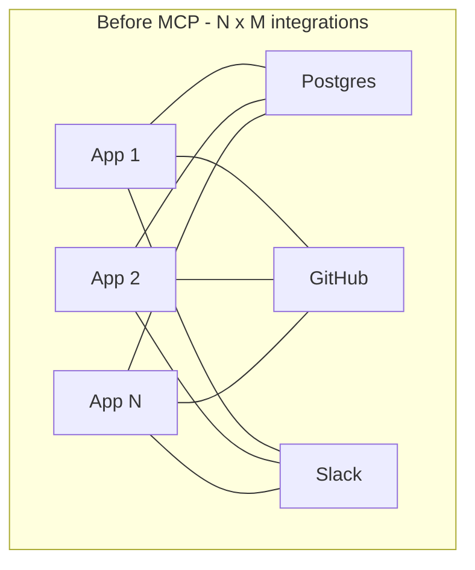
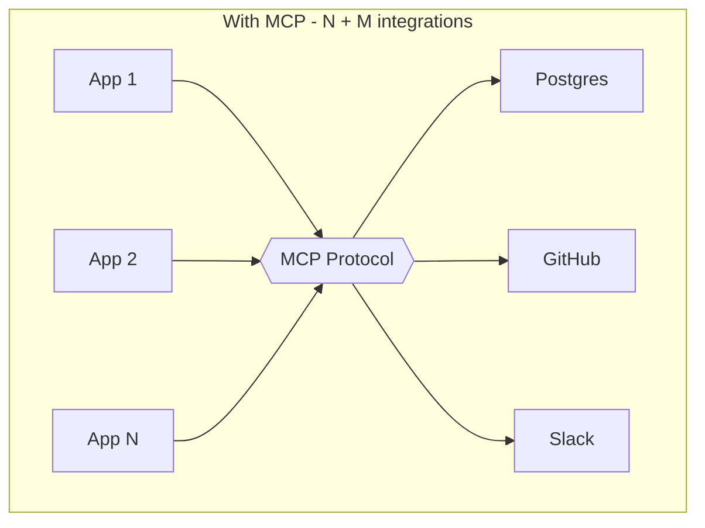

# Model Context Protocol (MCP)

> **Mental model:** MCP is the universal connector — one open protocol that lets OpenCode talk to **external tools** (browsers, databases, search engines, ticket systems) without writing custom integrations for each. Think USB-C for AI integrations.

## Why MCP exists

Before MCP, every AI app needed a custom integration for every tool — `N × M` brittle one-off connections:



MCP collapses this to `N + M`: each app implements MCP once, each tool exposes MCP once.



For OpenCode that means you get a Playwright MCP server, a Sentry MCP server, a Postgres MCP server, etc. — and any of them works without OpenCode-specific glue code.

## Local vs. remote servers

OpenCode supports both, declared in `opencode.json` under `mcp`.

### Local servers — spawned subprocess

```json
{
  "$schema": "https://opencode.ai/config.json",
  "mcp": {
    "playwright": {
      "type": "local",
      "command": ["npx", "-y", "@playwright/mcp@latest"],
      "enabled": true,
      "environment": { "BROWSER_TYPE": "chromium" },
      "timeout": 5000
    }
  }
}
```

| Key | Required | Notes |
|---|---|---|
| `type` | yes | `"local"` |
| `command` | yes | Array form — argv-style |
| `enabled` | no | Default `true`; set `false` to keep the entry but disable it |
| `environment` | no | Extra env vars for the subprocess |
| `timeout` | no | Tool-call timeout (ms). Default 5000. |

### Remote servers — HTTP

```json
{
  "mcp": {
    "context7": {
      "type": "remote",
      "url": "https://mcp.context7.com/mcp",
      "headers": { "CONTEXT7_API_KEY": "{env:CONTEXT7_API_KEY}" }
    }
  }
}
```

| Key | Required | Notes |
|---|---|---|
| `type` | yes | `"remote"` |
| `url` | yes | HTTPS endpoint |
| `headers` | no | Custom HTTP headers (supports `{env:NAME}`) |
| `oauth` | no | Pre-registered OAuth client credentials |

## OAuth

OpenCode handles OAuth automatically for remote servers that support it. When a server returns 401, OpenCode initiates Dynamic Client Registration (RFC 7591), pops a browser to complete auth, and stores the credentials locally.

```json
{
  "mcp": {
    "sentry": {
      "type": "remote",
      "url": "https://mcp.sentry.dev/mcp",
      "oauth": {}
    }
  }
}
```

For servers that require pre-registered credentials:

```json
{
  "mcp": {
    "my-corp-api": {
      "type": "remote",
      "url": "https://mcp.example.com/mcp",
      "oauth": {
        "clientId": "{env:CLIENT_ID}",
        "clientSecret": "{env:CLIENT_SECRET}",
        "scope": "tools:read tools:execute"
      }
    }
  }
}
```

### Managing servers from the CLI

```bash
opencode mcp add               # interactively register a local or remote server
opencode mcp list              # show servers and auth status
opencode mcp auth sentry       # complete or refresh OAuth flow
opencode mcp logout sentry     # forget stored credentials
opencode mcp debug sentry      # diagnose connection issues
```

`opencode mcp add` walks you through type, command/URL, and headers, then writes the entry to your config — the no-hand-editing alternative to the JSON blocks above.

## Token budget warning

MCP tools land in the model's tool surface every turn. Heavy servers (e.g., a full GitHub MCP with dozens of tools) can easily eat 10K+ tokens of context — purely for tool *descriptions* the model may never actually call.

Disable noisy tools at the project level and re-enable them only for agents that need them:

```json
{
  "tools": {
    "github_*": false,
    "slack_*": false
  },
  "agent": {
    "issue-triager": {
      "tools": {
        "github_get_issue": true,
        "github_list_issues": true,
        "github_add_comment": true
      }
    }
  }
}
```

## Featured servers

This repo has walkthroughs for several MCP servers in [`../mcp-servers/`](../mcp-servers/).

| Server | Adds | Type | Source |
|---|---|---|---|
| **Playwright** | Browser automation (DOM, network, screenshots, accessibility) | local | [`@playwright/mcp`](https://github.com/microsoft/playwright-mcp) |
| **Context7** | Live, version-pinned library docs | remote | [`upstash/context7`](https://github.com/upstash/context7) |
| **Sentry** | Errors, traces, releases | remote (OAuth) | [`mcp.sentry.dev`](https://mcp.sentry.dev/) |
| **Grep by Vercel** | Code search across GitHub | remote | [`mcp.grep.app`](https://mcp.grep.app/) |
| **Chrome DevTools** | Drive a real Chrome instance | local | [`ChromeDevTools/chrome-devtools-mcp`](https://github.com/ChromeDevTools/chrome-devtools-mcp) |
| **Memory / mem0** | Long-term cross-session memory | local/remote | [`mem0ai/mem0`](https://github.com/mem0ai/mem0) |
| **Tavily** | Web search + extraction for agents | remote | [`tavily-ai/tavily-mcp`](https://github.com/tavily-ai/tavily-mcp) |
| **Sequential Thinking** | Step-by-step reasoning helper | local | [`modelcontextprotocol/servers`](https://github.com/modelcontextprotocol/servers) |

## Invocation from a prompt

Reference an MCP server's tools naturally — OpenCode surfaces them as additional tools:

```text
use playwright to open https://example.com and screenshot the navbar
look up the React Router v7 changelog (use context7)
search the codebase for `parseToken` calls with grep
```

## Discovery — the MCP Registry

The [Official MCP Registry](https://registry.modelcontextprotocol.io/) (live since 2025) catalogues vetted servers. Browse via the website or look for `opencode mcp` discovery features in newer versions.

## Troubleshooting

| Problem | Fix |
|---|---|
| Server fails to connect | `opencode mcp debug <name>` |
| OAuth flow stuck | `opencode mcp logout <name>` then `opencode mcp auth <name>` |
| Server eats too many tokens | Disable tools you don't use via the `tools` map |
| `command not found` for local server | Make sure the binary is on `$PATH` or use a fully-qualified `npx` invocation |
| Connection times out | Bump `timeout` (default 5000ms) |

> 📚 Full MCP guide: [opencode.ai/docs/mcp-servers](https://opencode.ai/docs/mcp-servers) · Registry: [registry.modelcontextprotocol.io](https://registry.modelcontextprotocol.io/) · Protocol spec: [modelcontextprotocol.io](https://modelcontextprotocol.io/).
